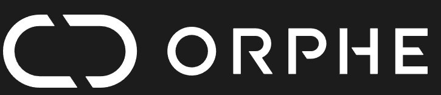

# 🎵 ORPHE DDR GAME

A DDR (Dance Dance Revolution) style rhythm game that can be played with both keyboard and ORPHE CORE motion sensors.



## 🎮 Overview

This is a vertical scrolling rhythm game where arrows fall from the top of the screen. Players must press the corresponding arrow key or perform the correct step motion with ORPHE CORE when the arrows reach the judgment line at the bottom.

## ✨ Features

- **Dual Input Support**: Play with keyboard or ORPHE CORE sensors
- **Multiple Difficulty Levels**: Easy, Medium, and Hard charts
- **Real-time Scoring**: Perfect, Good, OK, and Miss judgments
- **Combo System**: Build combos for bonus points
- **Customizable Settings**: Adjust note speed, timing windows, and volume
- **Beautiful Visual Effects**: Animated backgrounds and hit effects
- **ORPHE CORE Integration**: Uses gait direction detection for step-based gameplay

## 📁 Project Structure

```
GAME-DDR/
├── index.html              # Main HTML file with UI
├── style.css               # Game styling
├── main.js                 # Game initialization and ORPHE integration
├── game/
│   ├── audio.js           # Web Audio API manager
│   ├── chart.js           # Chart data handler (譜面データ)
│   ├── player.js          # Input handling and scoring
│   └── render.js          # Canvas rendering engine
├── assets/
│   ├── charts/            # JSON chart files
│   │   ├── sample.json    # Easy difficulty
│   │   ├── medium.json    # Medium difficulty
│   │   └── hard.json      # Hard difficulty
│   └── sounds/            # Sound effects (optional)
└── music/                 # Background music files
```

## 🎯 How to Play

### Keyboard Controls

- **←** (Left Arrow): Left lane
- **↓** (Down Arrow): Down lane
- **↑** (Up Arrow): Up lane
- **→** (Right Arrow): Right lane

### ORPHE CORE Controls

Connect ORPHE CORE sensors and perform steps in the following directions:

- **Left Step** (direction = 0): Left lane
- **Forward Step** (direction = 2): Up lane
- **Backward Step** (direction = 4): Down lane
- **Right Step** (direction = 6): Right lane

### Gameplay

1. Select a chart difficulty from the dropdown menu
2. Adjust game settings (note speed, judge window, volume)
3. Connect ORPHE CORE devices (optional)
4. Click "START GAME"
5. Wait for the countdown (3, 2, 1, START!)
6. Press keys or step when arrows reach the white judgment line
7. Build combos for bonus points
8. Complete the song to see your final score

## 📊 Scoring System

### Judgment Types

| Judgment | Timing Window | Points | Description |
|----------|---------------|--------|-------------|
| **PERFECT** | ±50ms | 100 | Excellent timing! |
| **GOOD** | ±100ms | 50 | Good timing |
| **OK** | ±150ms | 25 | Just barely |
| **MISS** | Outside window | 0 | No points, combo broken |

### Combo Bonus

- Build combos by hitting notes consecutively
- Bonus points: `floor(combo / 10) × 10`
- Missing a note resets your combo to 0

### Final Score

Your final score is calculated based on:
- Total points from all judgments
- Combo bonuses
- Accuracy percentage

## ⚙️ Game Settings

### Note Speed (200-600 px/s)
Controls how fast notes fall. Higher values make the game more challenging.

### Judge Window (50-200ms)
Controls the strictness of timing judgments. Lower values require more precise timing.

### Volume (0-100%)
Adjusts the music volume.

## 🔌 ORPHE CORE Setup

1. **Connect Devices**: Use the ORPHE CORE toolkit UI to connect your sensors
2. **Device Placement**: 
   - Sensor 1: Left foot (recommended)
   - Sensor 2: Right foot (optional)
3. **Calibration**: Stand normally and let the sensors calibrate
4. **Start Playing**: The game automatically detects step directions

### Direction Mapping

The game uses ORPHE's `gait.direction` property:

```javascript
Direction Values:
0 → Left step  → Lane 0 (←)
2 → Forward    → Lane 2 (↑)
4 → Backward   → Lane 1 (↓)
6 → Right step → Lane 3 (→)
```

### Preventing Double Triggers

The game implements several mechanisms to prevent duplicate inputs:
- Direction change detection (only triggers when direction changes)
- Result flag (blocks input for 200ms after a hit)
- Last direction tracking per device

## 📝 Creating Custom Charts

Charts are JSON files stored in `assets/charts/`. Here's the format:

```json
{
  "name": "My Chart",
  "difficulty": "Easy",
  "bpm": 120,
  "offset": 0.5,
  "notes": [
    { "time": 2.0, "lane": 0 },
    { "time": 2.5, "lane": 2 },
    { "time": 3.0, "lane": 3 }
  ]
}
```

### Chart Properties

- **name**: Chart display name
- **difficulty**: Easy, Medium, or Hard
- **bpm**: Beats per minute (affects visual timing)
- **offset**: Start time offset in seconds
- **notes**: Array of note objects
  - **time**: When the note should be hit (in seconds)
  - **lane**: Which lane (0=left, 1=down, 2=up, 3=right)

### Creating a Chart

1. Create a new `.json` file in `assets/charts/`
2. Follow the format above
3. Add your chart name to the dropdown in `index.html`
4. Add a new option in the chart selector:

```html
<option value="mychart">My Custom Chart</option>
```

## 🎵 Adding Music

1. Place your music file in the `music/` folder
2. Supported formats: MP3, WAV, OGG
3. The game will automatically try to load `music/sample.mp3` by default
4. To use a different file, update the music path in `main.js`:

```javascript
const musicPath = `music/your-song.mp3`;
```

## 🐛 Troubleshooting

### ORPHE CORE Not Connecting

- Check that ORPHE-CORE.js is loaded properly
- Ensure Bluetooth is enabled on your device
- Try refreshing the page and reconnecting

### Notes Not Appearing

- Check that the chart file is properly formatted
- Verify the file path in the chart selector
- Open browser console (F12) for error messages

### Timing Issues

- Adjust the chart's `offset` property
- Calibrate your audio/video sync settings
- Try adjusting the note speed

### Input Not Registering

- Check that keyboard focus is on the game window
- For ORPHE: Ensure devices are connected and calibrated
- Verify that game state is "playing"

## 🛠️ Technical Details

### Architecture

The game follows a modular architecture similar to GAME-PINGPONG:

1. **AudioManager**: Handles music playback and timing
2. **ChartManager**: Loads and manages note data
3. **PlayerManager**: Processes input and calculates scores
4. **GameRenderer**: Renders everything on canvas

### Game Loop

```javascript
gameLoop() → 
  Get current time →
  Fetch visible notes →
  Render frame →
  Check for completion →
  Request next frame
```

### Input Flow

```
Keyboard Press / ORPHE Step →
  handleGameInput(lane) →
  chartManager.checkHit(time, lane) →
  playerManager.processHit(result) →
  Update score & display judgment
```

## 📜 Code Reference

### Main Game Functions

- `init()`: Initialize all game systems
- `setupOrpheCORE()`: Configure ORPHE CORE devices
- `startGame()`: Begin gameplay
- `gameLoop()`: Main rendering loop
- `handleOrpheInput(direction)`: Process ORPHE step input
- `handleGameInput(lane)`: Universal input handler

### ORPHE Integration

```javascript
// Setup ORPHE callbacks
ble.gotGait = function(_gait) {
    const direction = _gait.direction;
    handleOrpheInput(direction);
};
```

## 🎨 Customization

### Changing Colors

Edit `game/render.js` to customize colors:

```javascript
this.arrowColors = ['#FF4444', '#44FF44', '#4444FF', '#FFAA00'];
```

### Adjusting Difficulty

Modify timing windows in `game/player.js`:

```javascript
this.judgeWindow = {
    perfect: 0.05,  // 50ms
    good: 0.1,      // 100ms
    ok: 0.15        // 150ms
};
```

## 📦 Dependencies

- **ORPHE-CORE.js**: Main library for ORPHE sensor integration
- **CoreToolkit.js**: UI toolkit for device connection
- **Bootstrap 5**: UI styling framework
- **Modern Browser**: Chrome, Firefox, Safari, or Edge (with Canvas support)

## 🚀 Deployment

### Local Testing

1. Clone the repository
2. Open a terminal in the project root
3. Start a local server:
   ```bash
   python -m http.server 8000
   # or
   npx serve
   ```
4. Open `http://localhost:8000/examples/GAME-DDR/`

### Production Deployment

- Ensure all assets are properly linked
- Use relative paths for all resources
- Test on target devices (especially ORPHE CORE connectivity)
- Consider adding loading screens for better UX

## 📄 License

This project is part of the ORPHE-CORE.js examples collection.

## 🤝 Contributing

To contribute improvements:

1. Follow the existing code structure
2. Test thoroughly with both keyboard and ORPHE CORE
3. Document any new features
4. Ensure compatibility with GAME-PINGPONG patterns

## 📞 Support

For issues related to:
- **ORPHE CORE Hardware**: Contact Orphe Inc.
- **Game Bugs**: Check browser console and open an issue
- **Custom Charts**: Refer to the "Creating Custom Charts" section

## 🎓 Learning Resources

- [ORPHE-CORE.js Documentation](../../README.md)
- [Web Audio API Guide](https://developer.mozilla.org/en-US/docs/Web/API/Web_Audio_API)
- [Canvas API Reference](https://developer.mozilla.org/en-US/docs/Web/API/Canvas_API)
- [DDR Game Design Principles](https://en.wikipedia.org/wiki/Dance_Dance_Revolution)

---

**Have fun playing! 🎉**
