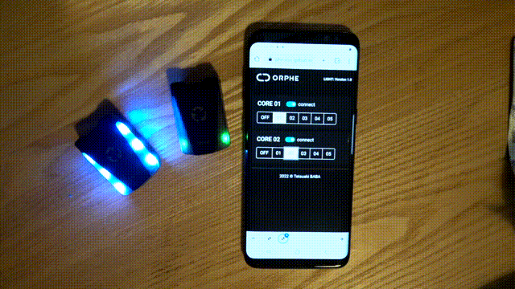

# LIGHT

## Overview
ORPHE.js LIGHT enables a user to control light emmitance on your ORPHE Core Module. 

## DEMO
if you have a ORPHE CORE, why not try [DEMO](https://orphe-oss.github.io/ORPHE-CORE.js/examples/LIGHT/) now ? 

## Issues
LED Brightness control does not work.

## Compatibility
  * Browser
    * Chrome browser
  * OS
    * macOS, windows, linux, android
  * ORPHE CORE
    * 2.0

## License & Requirements
|  | lisence | link | option | 
| - | - | - | - |
| orphe.js | MIT License  | -- |  -- |
| Bootstrap | MIT License | https://getbootstrap.com/ | v5.1.3 |
| BlueJelly | MIT License | https://github.com/electricbaka/bluejelly |  orphe.js is a customized file based on bluejelly.js | 
| Quaternion.js | MIT License | https://github.com/infusion/Quaternion.js |  v1.4.0 27/03/2022, Copyright (c) 2022, Robert Eisele (robert@xarg.org) |