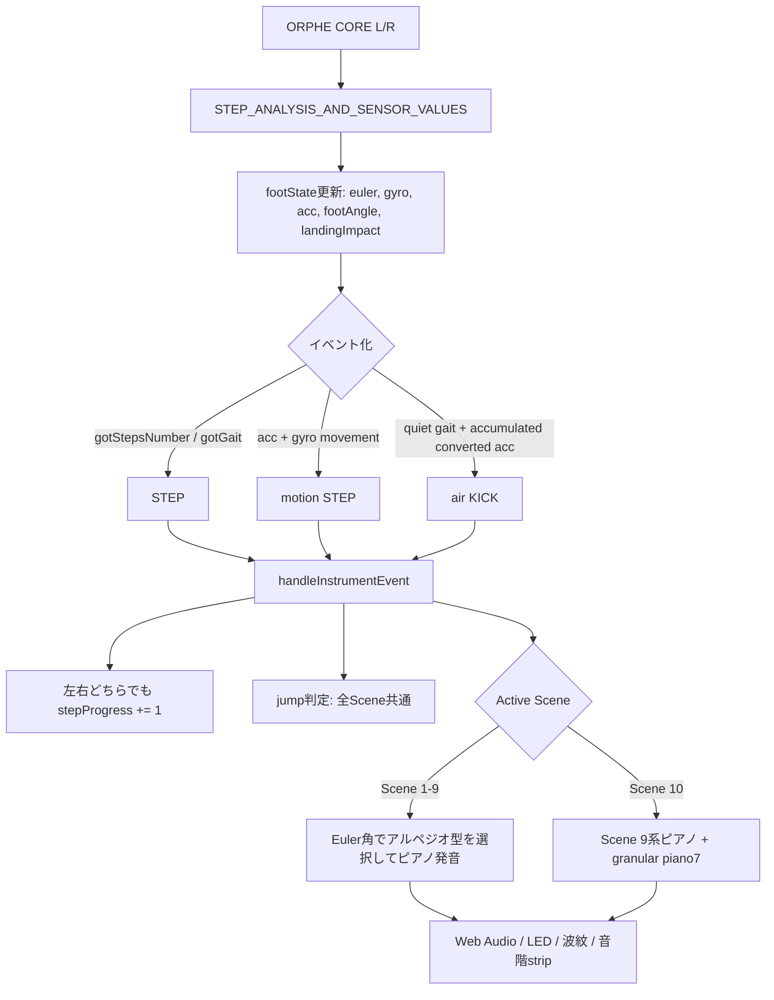
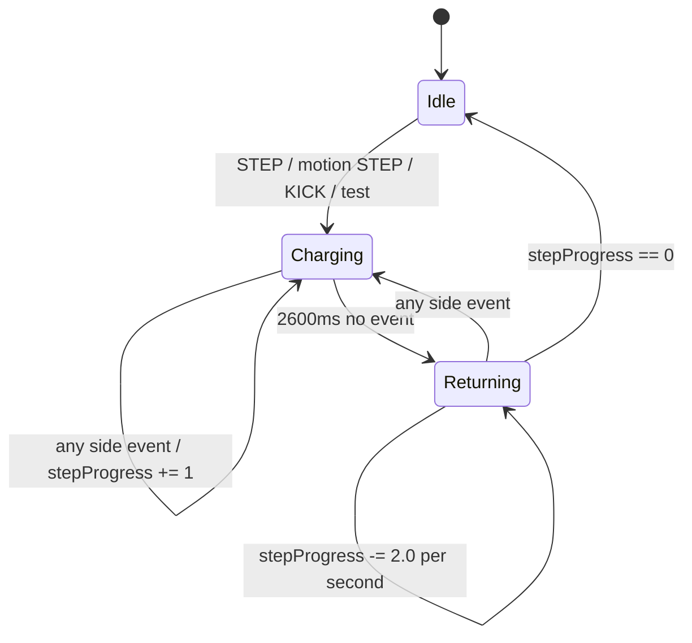
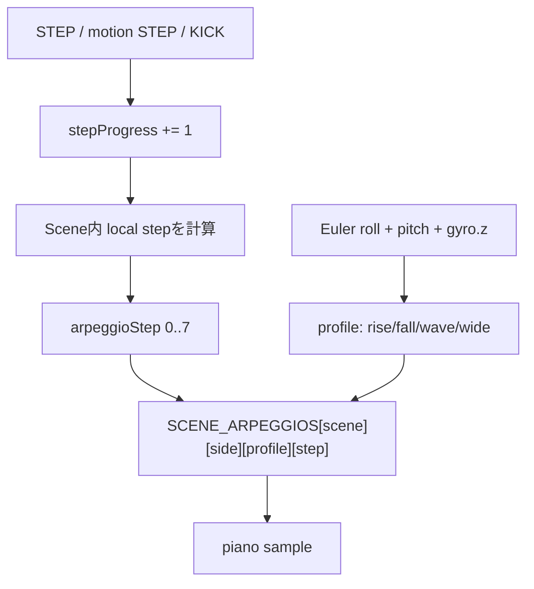
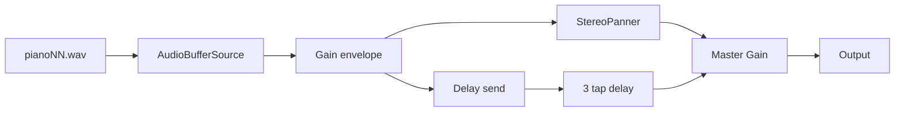

# ORPHE Piano Interaction Specification

このドキュメントは `examples/ORPHE-PIANO/` の現在の実装仕様です。
どの入力でSceneが進み、Euler角からどのアルペジオが選ばれ、どの音と波紋が出るかを追えるようにまとめています。

## 1. 作品概要

ORPHE Pianoは、左右2つのORPHE COREを使い、歩行・姿勢・空中動作をピアノサンプルと波紋に変換するブラウザ作品です。

現在の方針:

- 2つのCOREは左右どちらも演奏入力になる。
- STEP、motion STEP、KICKのどれでもScene進行ゲージが `+1` 進む。
- `8` 入力ごとにSceneが1つ進む。
- 歩かない/動かない状態が続くと、Scene進行ゲージが徐々に戻る。
- 音階はランダムではなく、Euler角で選ばれる8歩アルペジオで決まる。
- 前半Sceneは狭い分散、後半Sceneは広い分散と跳躍で和音感を強める。
- Scene 10はScene 9系のピアノアルペジオに `piano7.wav` のgranular burstを重ねる。

## 2. 主要ファイル

| ファイル | 役割 |
| --- | --- |
| `index.html` | UI、CoreToolkit、Canvas、操作パネル |
| `style.css` | 白ベースのメディアアートUI、一画面フィット |
| `sketch.js` | BLE入力、Scene進行、アルペジオ、Web Audio、Canvas描画 |
| `allpiano/piano*.wav` | ピアノサンプル |

## 3. 接続と入力

### 3.1 CORE接続

| UI | `bles` index | 役割 |
| --- | ---: | --- |
| `01` | `0` | Left |
| `02` | `1` | Right |

接続設定:

```js
{
  range: { acc: 16, gyro: 2000 },
  autoReconnect: false,
  forceDeviceSelection: true,
  useSharedBridge: false,
  rejectDuplicateDevices: true
}
```

意図:

- 左右それぞれで必ずデバイス選択ダイアログを出す。
- 同じCOREを左右に割り当てない。
- 作品中に別タブ共有BLEブリッジや自動再接続で左右が混ざることを避ける。

通知モードは `STEP_ANALYSIS_AND_SENSOR_VALUES` です。

### 3.2 センサ/歩行入力

| コールバック | 使い道 |
| --- | --- |
| `gotEuler` | アルペジオ型選択、TOE/FLAT/HEEL推定、円の位置 |
| `gotGyro` | motion STEP検出、アルペジオ型補助、円の位置 |
| `gotConvertedAcc` | motion STEP検出、空中KICK検出、Scene 10 granular制御 |
| `gotAcc` | `gotConvertedAcc` がない場合のmotion STEP代替 |
| `gotLandingImpact` | jump score用に保存する。KICK直接発火には使わない |
| `gotFootAngle` | TOE/FLAT/HEEL推定 |
| `gotStepsNumber` | STEP event |
| `gotGait` | STEP event |

### 3.3 UI入力

| UI | 動作 |
| --- | --- |
| `Sound On` | Web Audioを有効化し、サンプルをロードする |
| `Sound Off` | 音をフェードアウトし、以後の発音を止める |
| `Left` / `Right` | 左右のSTEP相当イベントをテスト発火する |
| `Scene` | `Auto by walking` または Scene 1-10 の手動固定 |
| `Volume` | master gain |
| `Sustain` | sample再生長と波紋寿命 |
| `Sensitivity` | motion STEPと空中KICKの出やすさ |

## 4. 入力から音までの全体フロー



## 5. Scene進行

### 5.1 閾値

`Auto by walking` では `stepProgress` によってSceneを決めます。

| `stepProgress` 下限 | Scene |
| ---: | ---: |
| 0 | 1 |
| 8 | 2 |
| 16 | 3 |
| 24 | 4 |
| 32 | 5 |
| 40 | 6 |
| 48 | 7 |
| 56 | 8 |
| 64 | 9 |
| 72 | 10 |

`MAX_STEP_PROGRESS` は `80` です。Scene 11は音がないため実装しません。

### 5.2 進む条件

以下のどれでも `stepProgress += 1` します。

- 左COREのSTEP
- 右COREのSTEP
- 左COREのmotion STEP
- 右COREのmotion STEP
- 左COREのKICK
- 右COREのKICK
- `Left` / `Right` test



### 5.3 戻る条件

最後のSTEP/motion STEP/KICK/testから `2600ms` 経つと、毎秒 `2.0` ずつ `stepProgress` が減ります。しきい値を下回るとSceneも1つずつ戻ります。

## 6. STEP / motion STEP / KICK

### 6.1 STEP

歩行解析イベントから直接作るSTEPです。

| 入口 | 条件 | power |
| --- | --- | ---: |
| `gotStepsNumber` | `steps.value` が前回値から変化 | `0.72` |
| `gotGait` | `gait.steps` が前回値から変化 | `0.70` |

この2つは `lastAnalysisAt` を更新し、空中KICK用のacc蓄積をリセットします。

### 6.2 motion STEP

歩行解析イベントが取れない細かい動きも、加速度とジャイロから軽いSTEPとして拾います。

```text
accMag = magnitude(acc)
accDelta = abs(accMag - previousAccMagnitude)
gyroMag = magnitude(gyro)
movement = movement * 0.75 + (accDelta + gyroMag * 0.52) * 0.25
power = clamp(movement * 1.2, 0, 1.6)
motionThreshold = 0.84 - sensitivity * 0.48
```

`movement > motionThreshold` かつ前回motion STEPから `180ms` 以上経っていれば、motion STEPを発火します。

### 6.3 空中KICK

KICKは「地面に接地した強い着地」ではなく、「歩容解析が直近出ていない状態で、空中で強く動かした」入力として検出します。

条件:

- 入力源が `gotConvertedAcc` である。
- 直近の `gotStepsNumber` / `gotGait` から `650ms` 以上経っている。
- `480ms` の蓄積窓内で、converted acc由来のenergyがしきい値を超える。
- 蓄積サンプル数が `4` 以上。
- 前回KICKから `520ms` 以上経っている。

蓄積:

```text
dynamicAcc = max(0, accDelta - 0.025)
airborneAcc = max(0, accMag - 1.04)
airKickEnergy += dynamicAcc * 1.45 + airborneAcc * 0.42 + gyroMag * 0.08
airKickThreshold = 2.25 - sensitivity * 0.95
```

KICK power:

```text
kickPower = clamp(0.48 + airKickEnergy * 0.22 + gyroMag * 0.18, 0.55, 1.45)
```

## 7. TOE / FLAT / HEEL

STEP/KICK時の接地姿勢ラベルは、`footAngle` があればそれを優先し、なければEuler pitchから推定します。

```text
classifierValue = abs(footAngle) > 1
  ? footAngle * 0.01745
  : euler.pitch

classifierValue >  0.18 => HEEL
classifierValue < -0.18 => TOE
otherwise              => FLAT
```

この分類は発音する音そのものではなく、波紋色、readout、円のdetail labelに影響します。

## 8. アルペジオ選択

### 8.1 基本

Scene 1-9はピアノアルペジオSceneです。Scene 10も同じピアノアルペジオを鳴らした上でgranularを重ねます。

1つのSceneには左右それぞれ4種類の8音アルペジオがあります。

| profile | 方向 |
| --- | --- |
| `rise` | 上昇系 |
| `fall` | 下降系 |
| `wave` | 上下に揺れる系 |
| `wide` | 跳躍が大きい系 |

### 8.2 Euler角からprofileを決める

```text
angle = clamp(euler.roll + euler.pitch * 0.35 + gyro.z * 0.08, -1, 1)

angle < -0.35 => rise
angle <  0.05 => fall
angle <  0.45 => wave
otherwise     => wide
```

歩き方や足の傾け方が変わると、同じSceneでも違うアルペジオ型になります。

### 8.3 8歩内の音を決める

Auto時:

```text
local = clamp(stepProgress - sceneStart, 0, 7.999)
arpeggioStep = clamp(max(0, ceil(local) - 1), 0, 7)
```

手動Scene時:

```text
arpeggioStep = floor(stepProgress) % 8
```

`arpeggioStep` が `0..7` の8音フレーズ内位置になります。



### 8.4 Sceneごとの音域設計

前半は音域が狭く、後半ほど跳躍と上下分散が大きくなります。

| Scene | 設計 |
| ---: | --- |
| 1 | A4-B4-D5-E5 / D5-E5-G5-A5周辺。小さな分散 |
| 2 | Scene 1より少し音数を増やし、同一調性感内で上下 |
| 3 | F4-A4-C5-D5-E5-G5周辺。少し広い和声 |
| 4 | D# / G# / A# / C 系の暗めの響き |
| 5 | A-D-E-A と D#-G#-A# 系の対比 |
| 6 | A#3-B3からG#5まで広げる中盤の転換 |
| 7 | G#3からF6まで。跳躍を大きくする |
| 8 | 高域の密度を増やし、C#6-D#6-G6-A#6まで使う |
| 9 | 低音から高音まで広いアルペジオ。jumpと共存 |
| 10 | Scene 9系のピアノアルペジオ + granular |

## 9. Scene 8 accompaniment

Scene 8では、通常のアルペジオに加えて、進行イベントごとに `scene8Counter` が `1..16` で進みます。

| Counter | 伴奏 |
| ---: | --- |
| 1 | `piano1.wav` |
| 5 | `piano2.wav` |
| 9 | `piano3.wav` |
| 13 | `piano2.wav` |
| 16 | jump判定を強制実行 |

## 10. Jump

Jumpは全Sceneで判定します。Scene 9限定ではありません。

score:

```text
accScore = max(0, (left.acc.z + right.acc.z) * 30)
gyroXScore = (abs(left.gyro.x * -2) + abs(right.gyro.x * -2)) * 50
gyroZScore = (convertGyroTo4Range(left.gyro.z) + convertGyroTo4Range(right.gyro.z)) * 18
landingScore = (left.landingImpact + right.landingImpact) * 25
score = accScore + gyroXScore + gyroZScore + landingScore - 100
```

条件:

- `score > 180`
- 前回jumpから `450ms` 以上

音:

| choice | Sound |
| ---: | --- |
| 0 | `piano11.wav` |
| 1 | `piano12.wav` |

choiceは通常時ランダムです。Scene 8 counter 16で強制jumpするときは、前回choiceと交互になります。

## 11. Scene 10 hybrid

Scene 10は単独granularではなく、以下を同時に行います。

1. Scene 9系のEuler選択ピアノアルペジオを鳴らす。
2. `piano7.wav` をgranular burstとして重ねる。

granular条件:

- Scene 10である。
- `left.power + right.power > 0.3`。
- 前回granularから `3s` 以上。

test時はpower不足でも発火します。

granular設定:

| 制御 | 値 |
| --- | --- |
| source | `piano7.wav` |
| burst duration | `2.85s` |
| grain interval | `45ms` |
| grain length | `35ms..175ms` |
| offset | `left.acc.y` |
| length control | `right.acc.y` |
| playback rate | `0.85..1.10` |
| pan | `(right.power - left.power) * 0.7` |

## 12. Web Audio

`Sound On` でAudioContextを開始し、48サンプルをロードします。

通常sample再生:



主な値:

| 項目 | 値 |
| --- | --- |
| attack | `6ms` |
| duration | `buffer.duration * (0.72 + sustain * 0.35)` |
| retrigger guard | 同一sample `50ms` 未満を抑制 |
| master gain | `volume * fade * 0.82` |
| delay taps | `150ms`, `300ms`, `375ms` |

KICKで高域sampleを鳴らす場合はdelay sendを `0.75`、jumpは `0.25` 送ります。

## 13. Visual / UI

### 13.1 円の位置

```text
targetX = 0.5 + gyro.z * -0.22 + roll * 0.12 + sideOffset
targetY = 0.54 + gyro.x * -0.26

sideOffset:
  left  = -0.08
  right =  0.08
```

### 13.2 波紋色

色は以下で変わります。

| 要素 | 影響 |
| --- | --- |
| 左右 | 左は緑系、右は紫系 |
| sample number | pitch classで色相を変える |
| Scene | 後半ほど多彩な `MONET_HUES` へ寄せる |
| TOE/FLAT/HEEL | 色相を少しずらす |
| KICK / jump / granular | hue offsetで強い反応にする |

Sceneの多彩さ:

```text
richness = clamp((scene - 1) / 9, 0, 1)
```

Sceneが進むほど、背景wash、secondary arc、tertiary arcが増えます。

### 13.3 UI表示

| 表示 | 内容 |
| --- | --- |
| Canvas | 左右の足円、波紋、Scene進捗 |
| Scene card | Scene、sample load、`stepProgress`、charging/returning |
| L/R card | 直近の音名、アルペジオ型、接続状態 |
| 下部音階strip | 現在Sceneで鳴り得る音。Scene 10は `piano7 granular` も表示 |
| LED | `setLED(1, 1 + noteIndex % 4)` を試行 |

## 14. チューニングポイント

| 目的 | 調整箇所 |
| --- | --- |
| Scene進行速度 | `SCENE_THRESHOLDS`, `MAX_STEP_PROGRESS` |
| 戻り速度 | `STEP_DECAY_DELAY_MS`, `STEP_DECAY_PER_SECOND` |
| motion STEP感度 | `motionThreshold = 0.84 - sensitivity * 0.48` |
| 空中KICK感度 | `AIR_KICK_WINDOW_MS`, `AIR_KICK_GAIT_QUIET_MS`, `airKickThreshold` |
| TOE/FLAT/HEEL分類 | `classifyStepPosition()` の `0.18` |
| アルペジオ型の角度分類 | `getArpeggioProfileIndex()` |
| Sceneごとの音 | `SCENE_ARPEGGIOS` |
| Scene 10 granular | `triggerGranular()` |
| 波紋色 | `MONET_HUES`, `colorForSound()` |
