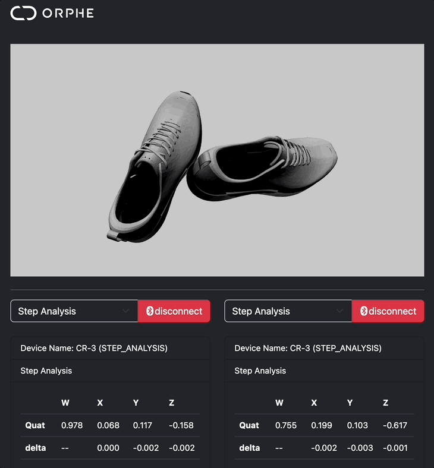

# Data Viewer

## Overview
Simple viewer application for Step Analysis and Sensor Values by BLE ORPHE Core Module.

## Known issues
  * CGが両方のとも右用
  * 5分くらいつないでから一回disconnectしても一回つなごうとするとエラーになっちゃう（Uncaught (in promise) DOMException: Failed to execute 'startNotifications' on 'BluetoothRemoteGATTCharacteristic': GATT Server is disconnected. Cannot perform GATT operations. (Re)connect first with `device.gatt.connect`. at http://127.0.0.1:5501/assets/js/orphe.js:208:31）
  * 最初に右側をつなげようとするとエラー。必ず左側からお願いします。

## モジュール対応
  * CR-2
  * CR-3
